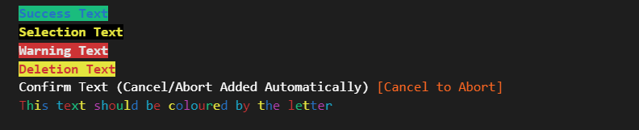

# Fancy Text
<p>A simple class that uses UNICODE escape sequences to print the Python's Terminal Output text in colour without adding any (non build-in) libraris imports to your code.<br>
also adds the functionality to print the desired text as UNICODE/ASCII blocks (work in progress)<br>
It provides a simpler and cleanear way to use colour and text effects in your program, while contributing to mantain code readability <br>

### Basic Setup / Usage

Copy the FancyText.py file to your project directory and import it as follows:<br>
`from FancyText Import *`

After that you can invoke the class by using:

`FancyText.[Colour]("Text")`

This will return the desired formated string for the colour effect to your text. 
(class is done this way to allow multiple colours options per line)

Example for a print statement:

`print(FancyText.red("This Text will be Red"))`

On this initial release FancyText the class Contains the basic EGA colours: <br>
Black, Dark Blue, Dark Green, Dark Cyan, Dark Red, Dark Magenta, Brown, Light Gray, Dark Gray, Light Blue, Light Green, Light Cyan, Light Red, Light Magenta, Yellow, White
it's planned on the roadmap to get it to 256 to be able to properly do gradients.

Plus Some special Text Colour modes (More will be added on future updates)

* success_text    - Blue text with Green Background                                       --- "Accepted Message"
* selection_text  - Bold Yellow text on Black Background                                  --- "Selection Message"
* warning_text    - White Text on Red Background                                          --- "Warning Message"
* deletion_text   - Red Text on Yellow Background                                         --- "Deletion Message"
* rainbow_text    - Each letter will be printed on a different colour                     --- "Rainbow Text"
* rainbow_bg      - The Background for each letter will be printed on a different colour  --- "Rainbow Background"
* toggle_case     - Toggles Text between Capital and lower per letter                     --- "Toggles Text"
* toggle_case_low - Toggles Text between Lower and Capital per letter                     --- "Toggle Text Low"

### Some Examples of Special texts<br>




I've Also implemented a Dictionary sorting to transform Text into ASCII Blocks, this allows to convert normal text to:
```

 █████  ███████  ██████ ██ ██     ████████ ███████ ██   ██ ████████ 
██   ██ ██      ██      ██ ██        ██    ██       ██ ██     ██    
███████ ███████ ██      ██ ██        ██    █████     ███      ██    
██   ██      ██ ██      ██ ██        ██    ██       ██ ██     ██    
██   ██ ███████  ██████ ██ ██        ██    ███████ ██   ██    ██    
                                                                    
```

Special ASCII Text Block Options (5 lines per letter, Creates Big Letters from the text provided)

* big_letter_from_letter -  ...Made out of each letter given
* Unicode-Blocks         -  ...Made out of ██ Blocks  

You can check the by typing Fancytext. and the autocomplete will show you all the available options

This is the initial Release, new features will be added in the future.

### Version History

* 0.06 Added UNICODE BLOCK ██ letters from text 
* 0.05 Added ASCII transforms for text (Big letter made of the letter)
* 0.04 Added Toggle Text (and lower start version)
* 0.03 Text is now printed in Bold, Added Rainbow Background function, Removed Confirm Text to make a better implementation
* 0.02 Added Rainbow_text colour option, Fixed bug with warning_text function
* 0.01 Initial Release - Class Created.

Author:
* [Jorge Rolo](https://github.com/JRoloS)


### License: 
Feel free to use, copy, fork, etc. Please Mention me and If you use or fork the code, and if you come up with a neat feature, please let me know let me know.
